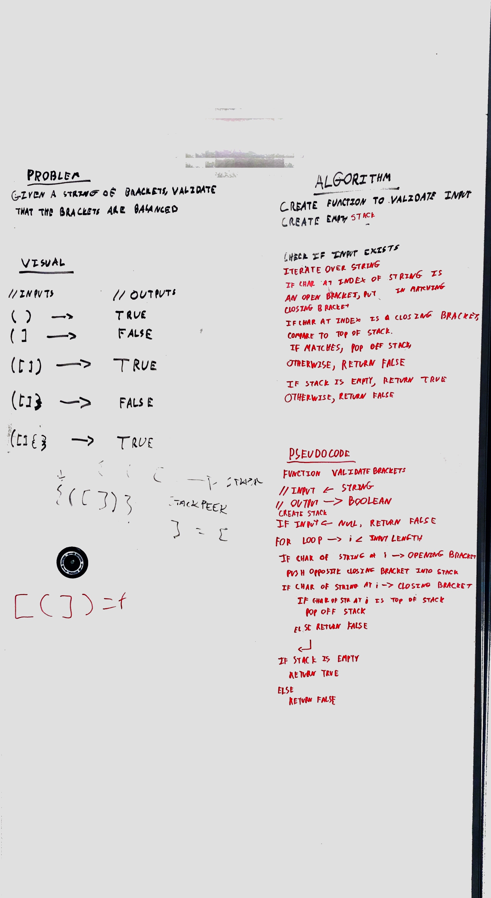

# Multi Bracket Validation

[PR]()

## Feature Tasks
* On your main file, create JavaScript: a function called multiBracketValidation(input)
* Your function should take a string as its only argument, and should return a boolean representing whether or not the brackets in the string are balanced. There are 3 types of brackets:
* Round Brackets : ()
* Square Brackets : []
* Curly Brackets : {}

## Tests
* “Happy Path” - Expected outcome
* Expected failure
* Edge Case (if applicable/obvious)

## Image

### Collaborators
* Daniel Logerstedt
