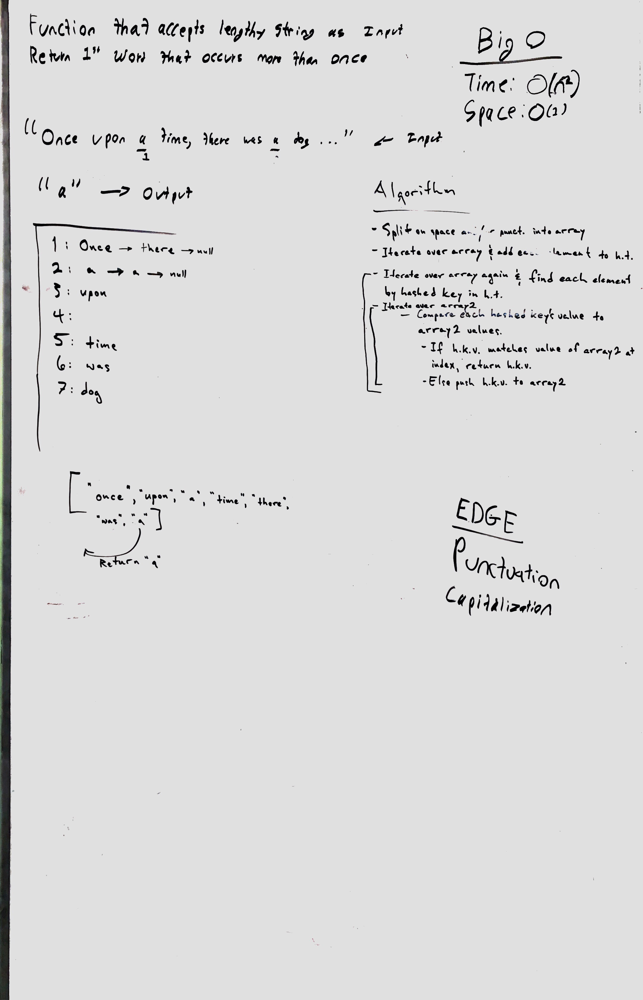

# Repeated Word
* [Repo]()
* [PR]()

## Challenge
* Write a function that accepts a lengthy string parameter.
* Without utilizing any of the built-in library methods available to your language, return the first word to occur more than once in that provided string.

## Approach & Efficiency
* Utilized the Single-responsibility principle
* Code is efficient, clean, and testable

### Author: Alexander White

### UML

