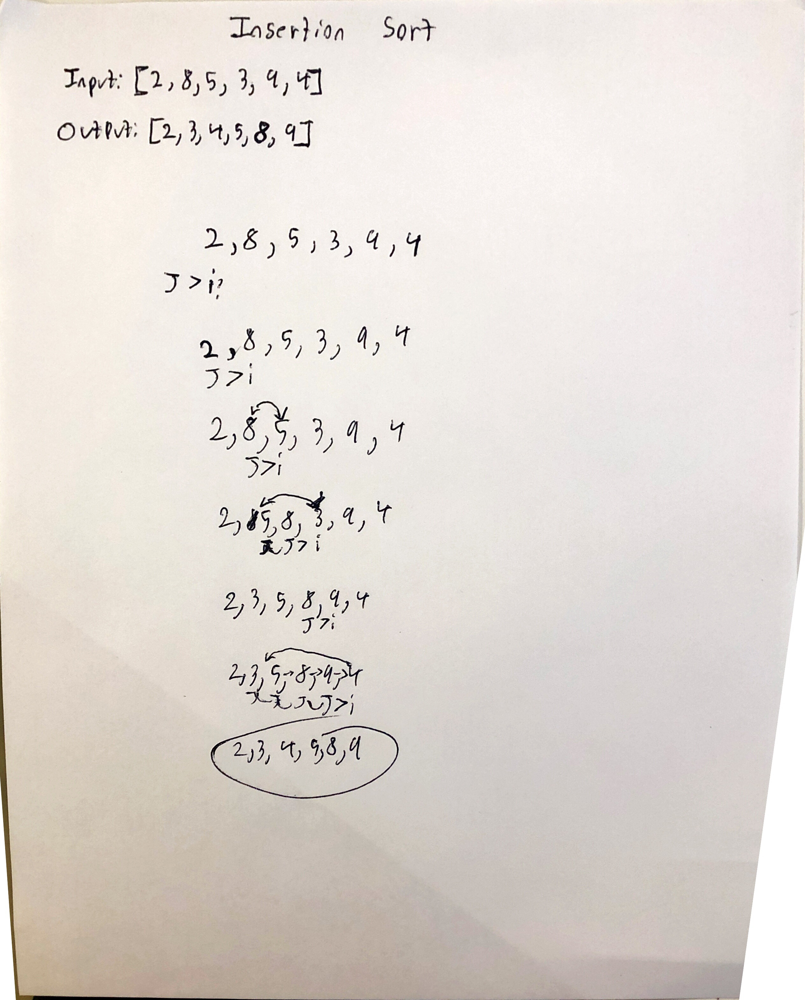

# Insertion Sort
[Repo](https://github.com/alex-white-401-advanced-javascript/data-structures-and-algorithms/tree/insertion-sort/code-challenges/sorts)
[PR](https://github.com/alex-white-401-advanced-javascript/data-structures-and-algorithms/pull/12)

## Challenge
* Write a function for insertion sort that takes in an unsorted array and returns the array sorted using insertion sort.

## Approach & Efficiency
* Utilized the Single-responsibility principle
* Code is efficient, clean, and testable

### Author: Alexander White

### UML

